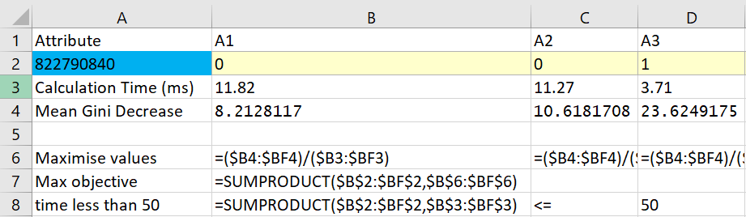

ENGSCI 255 Lab 2
================
Navindd Raj
Due Date: 5pm Monday 28 May 2018

## Question 1

``` r
set.seed(99)  # sets a seed for random number generator
spam.df = read.csv("spamdata.csv",header=TRUE) # read in the spam data
```

#### a) k-means clustering using all independent attributes:

``` r
# perform a k-means clustering with 20 iterations, using all 57 attributes
spamCluster = kmeans(spam.df, 2, nstart = 20, iter.max = 20)
spamCluster$size    # size of each cluster
```

    ## [1] 4357  244

Before we check the results of the clustering, we should find out how
many emails are actually spam.

``` r
numOfSpam = 0
for (i in seq(1,length(spam.df$IsSpam))) {
     if (spam.df$IsSpam[i] == 1) {
         numOfSpam = numOfSpam + 1
     }
}
print(numOfSpam)
```

    ## [1] 1813

We can see there are two clusters of size 4357 and 244, but there are
1813 spam emails in the dataset. So there will be a lot of false
predictions in our clustered data.

#### b) Generate a table for the clustering:

Next, let’s generate a table for the clustering results:

``` r
# columns are is/is not spam, rows are the two clusters created
table(spamCluster$cluster, spam.df$IsSpam, dnn = c("Cluster No", "Is/Is not Spam"))
```

    ##           Is/Is not Spam
    ## Cluster No    0    1
    ##          1 2735 1622
    ##          2   53  191

It seems like cluster 1 is predicting the group that isn’t spam, and
cluster 2 is predicting the group that is spam.

#### c) Calculations:

We can make the attribute each cluster is predicting the name of the
cluster, so it is easier to understand the calculations. We say that
something being spam is the positive result (1 or yes).

``` r
for (i in seq(1,length(spamCluster$cluster))) {
     # reduce the value by 1 so that each cluster represents what it is predicting
     spamCluster$cluster[i] = spamCluster$cluster[i] - 1
}

table(spamCluster$cluster, spam.df$IsSpam, dnn = c("Prediction", "Actual"))
```

    ##           Actual
    ## Prediction    0    1
    ##          0 2735 1622
    ##          1   53  191

If we used this clustering as a foundation for a spam filter, what is
the accuracy, sensitivity, specificity and precision of the filter?

Number of true negatives (TN) = 2735. Number of true positives (TP) =
191. Number of false positives (FP) = 53. Number of false negatives (FN)
=
1622.

\(\text{Accuracy = proportion of datapoints classified correctly} =\frac{TN+TP}{\text{total # of datapoints}} = \frac{2735+191}{2735+191+53+1622} = 0.6359\)

\(\text{Sensitivity = true positive rate} = \frac{TP}{TP+FN} = \frac{191}{191+1622} = 0.1054\)
. This is the proportion of datapoints which are predicted to be yes,
and are actually
yes.

\(\text{Specificity = true negative rate} = \frac{TN}{TN+FP} = \frac{2735}{2735+53} = 0.9810\)
. This is the proportion of datapoints which are predicted to be no, and
are actually no.

\(\text{Precision} = \frac{TP}{TP+FP} = \frac{191}{191+53} = 0.7828\) .
This is the proportion of datapoints which are actually yes, when they
are predicted to be yes.

## Question 2

``` r
set.seed(50)  # sets a seed for random number generator
```

Generate a training dataset of 2400 datapoints, where the remaining
points will be the test
set:

``` r
# training subset of 2400 datapoints, half is random spam emails, half is random not spam emails
# dataset is ordered so we know we are getting a 50/50 mix of 
train = c(sample(1:numOfSpam,1200),sample(numOfSpam+1:length(spam.df$IsSpam),1200))

# treat spam classification as a factor instead of numeric
spam.df$IsSpam = as.factor(spam.df$IsSpam)
```

#### a) Loss Matrices:

##### **i.**

Set the termination criteria of max depth of 10. Disable any other
termination
criteria:

``` r
# cp to 0 as we want to branch any time possible, minimum complexity parameter, minsplit 1
controlParms = rpart.control(maxdepth = 10, cp = 0, minsplit = 1)
```

##### **ii.**

We want to modify the loss matrix to generate 6 different trees using
all independent attributes, ranging from no FP’s to no FN’s in the
training data. This means we should put a heavy cost on the false
positives and low cost on false negatives, and then constantly make FP’s
lower cost and FN’s higher cost. The different elements in the matrix
correspond to the costs of the following:

``` r
list(loss = matrix(c("TN","FN","FP","TP"), nrow = 2))
```

    ## $loss
    ##      [,1] [,2]
    ## [1,] "TN" "FP"
    ## [2,] "FN" "TP"

**Tree 1** (aiming for no false positives), cost of 95 for FP’s, 5 for
FN’s:

``` r
# 95/5 cost for FP/FN
lossMatrix1 = list(loss = matrix(c(0,95,5,0), nrow = 2))

# create the tree using the preset control and the loss matrix
tree1 = rpart(IsSpam~., data = spam.df, subset = train, control = controlParms, parms = lossMatrix1)

# in-sample prediction using the training data:
ISCM1 = table(predict(tree1,spam.df[train,],type="class"),spam.df[train,"IsSpam"], dnn = c("Prediction", "Actual"))
ISCM1
```

    ##           Actual
    ## Prediction    0    1
    ##          0  524    0
    ##          1  212 1200

**Tree 2** (still a high weight on false positives), cost of 70 for
FP’s, 30 for FN’s:

``` r
# 70/30 cost for FP/FN
lossMatrix2 = list(loss = matrix(c(0,70,30,0), nrow = 2))

# create the tree using the preset control and the loss matrix
tree2 = rpart(IsSpam~., data = spam.df, subset = train, control = controlParms, parms = lossMatrix2)

# in-sample prediction using the training data:
ISCM2 = table(predict(tree2,spam.df[train,],type="class"),spam.df[train,"IsSpam"], dnn = c("Prediction", "Actual"))
ISCM2
```

    ##           Actual
    ## Prediction    0    1
    ##          0  688   14
    ##          1   48 1186

**Tree 3** (slightly higher weight on false negatives vs false
positives), cost of 45 for FP’s, 65 for FN’s:

``` r
# 45/65 cost for FP/FN
lossMatrix3 = list(loss = matrix(c(0,45,65,0), nrow = 2))

# create the tree using the preset control and the loss matrix
tree3 = rpart(IsSpam~., data = spam.df, subset = train, control = controlParms, parms = lossMatrix3)

# in-sample prediction using the training data:
ISCM3 = table(predict(tree3,spam.df[train,],type="class"),spam.df[train,"IsSpam"], dnn = c("Prediction", "Actual"))
ISCM3
```

    ##           Actual
    ## Prediction    0    1
    ##          0  726   53
    ##          1   10 1147

**Tree 4** (even higher weighting on false negatives), cost of 20 for
FP’s, 80 for FN’s:

``` r
# 20,80 cost for FP/FN
lossMatrix4 = list(loss = matrix(c(0,20,80,0), nrow = 2))

# create the tree using the preset control and the loss matrix
tree4 = rpart(IsSpam~., data = spam.df, subset = train, control = controlParms, parms = lossMatrix4)

# in-sample prediction using the training data:
ISCM4 = table(predict(tree4,spam.df[train,],type="class"),spam.df[train,"IsSpam"], dnn = c("Prediction", "Actual"))
ISCM4
```

    ##           Actual
    ## Prediction    0    1
    ##          0  735   83
    ##          1    1 1117

**Tree 5** (aiming for no false negatives), cost of 5 for FP’s, 95 for
FN’s:

``` r
# 5/95 cost for FP/FN
lossMatrix5 = list(loss = matrix(c(0,5,95,0), nrow = 2))

# create the tree using the preset control and the loss matrix
tree5 = rpart(IsSpam~., data = spam.df, subset = train, control = controlParms, parms = lossMatrix5)

# in-sample prediction using the training data:
ISCM5 = table(predict(tree5,spam.df[train,],type="class"),spam.df[train,"IsSpam"], dnn = c("Prediction", "Actual"))
ISCM5
```

    ##           Actual
    ## Prediction    0    1
    ##          0  736  151
    ##          1    0 1049

**Tree 6** (let’s see what happens if we put an even higher weight now
that we have achieved no false negatives already), cost of 1 for FP’s,
99 for FN’s:

``` r
# 1/99 cost for FP/FN
lossMatrix6 = list(loss = matrix(c(0,1,99,0), nrow = 2))

# create the tree using the preset control and the loss matrix
tree6 = rpart(IsSpam~., data = spam.df, subset = train, control = controlParms, parms = lossMatrix6)

# in-sample prediction using the training data:
ISCM6 = table(predict(tree6,spam.df[train,],type="class"),spam.df[train,"IsSpam"], dnn = c("Prediction", "Actual"))
ISCM6
```

    ##           Actual
    ## Prediction   0   1
    ##          0 736 251
    ##          1   0 949

##### **iii.**

The in-sample confusion matrices have already been shown in part ii
above, so I will just show the confusion matrices for the out-of-sample
predictions, using the test set (original dataset minus the training
set).

**Tree 1:**

``` r
# out-of-sample prediction using the test data:
OOSCM1 = table(predict(tree1,spam.df[-train,],type="class"),spam.df[-train,"IsSpam"], dnn = c("Prediction", "Actual"))
OOSCM1
```

    ##           Actual
    ## Prediction    0    1
    ##          0 1405   12
    ##          1  647  601

**Tree 2:**

``` r
# out-of-sample prediction using the test data:
OOSCM2 = table(predict(tree2,spam.df[-train,],type="class"),spam.df[-train,"IsSpam"], dnn = c("Prediction", "Actual"))
OOSCM2
```

    ##           Actual
    ## Prediction    0    1
    ##          0 1784   33
    ##          1  268  580

**Tree 3:**

``` r
# out-of-sample prediction using the test data:
OOSCM3 = table(predict(tree3,spam.df[-train,],type="class"),spam.df[-train,"IsSpam"], dnn = c("Prediction", "Actual"))
OOSCM3
```

    ##           Actual
    ## Prediction    0    1
    ##          0 1864   69
    ##          1  188  544

**Tree 4:**

``` r
# out-of-sample prediction using the test data:
OOSCM4 = table(predict(tree4,spam.df[-train,],type="class"),spam.df[-train,"IsSpam"], dnn = c("Prediction", "Actual"))
OOSCM4
```

    ##           Actual
    ## Prediction    0    1
    ##          0 1904   76
    ##          1  148  537

**Tree 5:**

``` r
# out-of-sample prediction using the test data:
OOSCM5 = table(predict(tree5,spam.df[-train,],type="class"),spam.df[-train,"IsSpam"], dnn = c("Prediction", "Actual"))
OOSCM5
```

    ##           Actual
    ## Prediction    0    1
    ##          0 1954  122
    ##          1   98  491

**Tree 6:**

``` r
# out-of-sample prediction using the test data:
OOSCM6 = table(predict(tree6,spam.df[-train,],type="class"),spam.df[-train,"IsSpam"], dnn = c("Prediction", "Actual"))
OOSCM6
```

    ##           Actual
    ## Prediction    0    1
    ##          0 1986  149
    ##          1   66  464

##### **iv.**

Put the values of sensitivity and specificity for each classification
model into a vector to then show on a scatterplot (including both in and
out-of-sample performance): \[Code for sensitivity/specificity
calculations hidden because messy\]

Show this information on a 2D scatterplot of sensitivity vs specificity,
again, the in-sample performance was using the training dataset and
out-of-sample performance used the original dataset minus the training
set. Note the axes don’t start from
0:

``` r
plot(inSampleSpecificity ~ inSampleSensitivity, data = performance1.df, col = "orange", pch = 16, cex = 1.2, ylim = c(0.6,1), xlim = c(0.7,1), ann = FALSE)
points(outOfSampleSpecificity ~ outOfSampleSensitivity, data = performance2.df, col = "blue", pch = 4, cex = 1.4)
legend("bottomleft", legend = c("In-sample performance", "Out-of-sample performance"), pch = c(16,4), col = c("orange","blue"))
title(main = "Specificity vs Sensitivity for a set of classification trees\nwith varying loss matrices", xlab = "Sensitivity", ylab = "Specificity")
```


#### b) Tree Depth:

##### **i.**

We want to generate six classification trees that vary by their max
depth (from 5 to 30). For this I have disabled any other stopping
criteria as otherwise the higher depth trees will all look the same and
not go until their max depth has been reached.

To save space, I used a list to store all 6 trees generated, indexed 1
through 6 corresponding to max depth of 5 through 30 in steps of 5 for
each tree:

``` r
# create a list to store the trees
trees = list()

for (i in seq(1,6)) {
  # max depth of 5 to 30, disable other stopping criteria
  controlParms = rpart.control(maxdepth = 5*i, cp = 0, minsplit = 1) 
  
  # create a tree for each max depth
  trees[[i]] = rpart(IsSpam~.,data = spam.df, subset = train, control = controlParms)
}
```

##### **ii.**

Plot the tree for a depth of
5:

``` r
fancyRpartPlot(trees[[1]], sub = "Tree using all independent vars, max depth 5")
```


##### **iii.**

We now want to plot the *accuracies* of the classification models vs the
max depths, one line for in-sample performance and one line for
out-of-sample performance.

First of all, let’s get some vectors of the accuracies for each tree
depth and their predictions for both in and out-of-sample data:

``` r
# create vectors to hold accuracies
ISAcc = c()
OOSAcc = c()

# generate confusion matrices, then put accuracies in lists for their respective predictions
for (i in seq(1,6)) {
  ISCM = table(predict(trees[[i]],spam.df[train,],type="class"),spam.df[train,"IsSpam"])
  OOSCM = table(predict(trees[[i]],spam.df[-train,],type="class"),spam.df[-train,"IsSpam"])
  
  # I couldn't simply use length(train) and length(spam.df$IsSpam - train) because the number of
  # predictions generated did not match the number of datapoints in the training set/ test set...
  # idk why, but the number of datapoints in the train+test results does sum to total # of datapoints
  ISAcc[i] = (ISCM[1]+ISCM[4])/(ISCM[1]+ISCM[2]+ISCM[3]+ISCM[4])
  OOSAcc[i] = (OOSCM[1]+OOSCM[4])/(OOSCM[1]+OOSCM[2]+OOSCM[3]+OOSCM[4])
}
```

Now let’s try plot the accuracies against the max depths for each tree.
Note again the axes don’t start from 0:

``` r
# create a vector holding the max depths
maxDepths = seq(5,30,5)

# plot the data and add information about it
plot(ISAcc ~ maxDepths, type = "n", ylim = c(0.85,1), ann = FALSE)
lines(ISAcc ~ maxDepths, col = "orange")
lines(OOSAcc ~ maxDepths, col = "blue")
legend("bottomleft", legend = c("In-sample performance", "Out-of-sample performance"), pch = "_", col = c("orange","blue"))
title(main = "Accuracies for a set of trees with varying max depths\n(with other stopping criteria disabled)", xlab = "Max Depth", ylab = "Accuracy")
```


#### c) Discuss the results above:

From the scatterplot (where max depth was constant and we changed the
loss matrices for each tree), we can infer that in general, as you try
to increase the sensitivity of a classification tree, the specificity
will drop as a result, and vice versa for increasing specificity. For
all trees, we have a decent ratio of specificity to sensitivity, meaning
we have hit reasonably optimal solutions, assuming we are weighting
specificity and sensitivity the same in a bi-objective optimasation
problem.

From the line graph (where the loss matrices were kept constant and we
changed the max depth for each tree), we can see that there are two
different trends. The in-sample performance kept improving as we
increased the max depth of the tree, but the out-of-sample performance
started dropping after the max depth of the tree was higher than 10.
This is probably due to overfitting the classification model to the
training data, so when applied to unseen data, it performs poorly as it
has been conditioned too far with the training data. So we can see that
the peak optimality (if we are aiming for accuracy) in this case is at a
max tree depth of 10, which is what we were using for when we were
varying the loss matrices in the first part of the question.

In both experiments, we can see that the out-of-sample performance was
poorer than the in-sample performance, which is expected. We should also
consider the fact that we may have overfit the trees for both
experiments, and to see if there is a more optimal max depth to use, we
should test further by checking varying max depths between 5 and 15 in
smaller increments, and possibly change the stopping criteria so that it
does have a minimum split of higher than 1 and requires some threshold
change in complexity before branching out.

## Question 3

``` r
set.seed(42)  # sets a seed for random number generator
```

#### a) Generate different random forests with 10, 100 and 100 trees:

``` r
# with 10 trees
spamForest1 = randomForest(IsSpam~., data = spam.df, ntree = 10)

# with 100 trees
spamForest2 = randomForest(IsSpam~., data = spam.df, ntree = 100)

# with 1000 trees
spamForest3 = randomForest(IsSpam~., data = spam.df, ntree = 1000)
```

#### b) Confusion matrices and calculations:

For forest with **10 trees**:

``` r
# generate confusion matrix
table(predict(spamForest1, spam.df, type = "response"), spam.df$IsSpam, dnn = c("Prediction", "Actual"))
```

    ##           Actual
    ## Prediction    0    1
    ##          0 2782   31
    ##          1    6 1782

\[\text{Accuracy} =\frac{TN+TP}{\text{total # of datapoints}} = \frac{2782+1782}{2782+31+6+1782} = 0.9920\]

\[\text{Sensitivity} = \frac{TP}{TP+FN} = \frac{1782}{1782+31} = 0.9829\]

\[\text{Specificity} = \frac{TN}{TN+FP} = \frac{2782}{2782+6} = 0.9978\]

\[\text{Precision} = \frac{TP}{TP+FP} = \frac{1782}{1782+6} = 0.9966\]

For forest with **100 trees**:

``` r
# generate confusion matrix
table(predict(spamForest2, spam.df, type = "response"), spam.df$IsSpam, dnn = c("Prediction", "Actual"))
```

    ##           Actual
    ## Prediction    0    1
    ##          0 2788   19
    ##          1    0 1794

\[\text{Accuracy} =\frac{TN+TP}{\text{total # of datapoints}} = \frac{2788+1794}{2788+19+0+1794} = 0.9959\]

\[\text{Sensitivity} = \frac{TP}{TP+FN} = \frac{1794}{1794+19} = 0.9895\]

\[\text{Specificity} = \frac{TN}{TN+FP} = \frac{2788}{2788+0} = 1.000\]

\[\text{Precision} = \frac{TP}{TP+FP} = \frac{1794}{1794+0} = 1.000\]

For forest with **1000 trees**:

``` r
# generate confusion matrix
table(predict(spamForest3, spam.df, type = "response"), spam.df$IsSpam, dnn = c("Prediction", "Actual"))
```

    ##           Actual
    ## Prediction    0    1
    ##          0 2788   20
    ##          1    0 1793

\[\text{Accuracy} =\frac{TN+TP}{\text{total # of datapoints}} = \frac{2788+1793}{2788+20+0+1793} = 0.9957\]

\[\text{Sensitivity} = \frac{TP}{TP+FN} = \frac{1793}{1793+20} = 0.9890\]

\[\text{Specificity} = \frac{TN}{TN+FP} = \frac{2788}{2788+0} = 1.000\]

\[\text{Precision} = \frac{TP}{TP+FP} = \frac{1793}{1793+0} = 1.000\]

#### c) Plot importance different attributes:

``` r
# using forest with 1000 trees
varImpPlot(spamForest3, main = "Importance of each variable for classifying spam emails")
```


A higher mean decrease in gini index means the variable has a higher
importance, so variables with points further to the right of the plot
are of higher importance for distinguishing spam emails.

The top 5 attributes are: “A52”, “A53”, “A7”, “A16” and “A55”, in
descending order of importance.

#### d) Scatterplot matrix of the top five attributes and comments:

Let’s make a scatterplot matrix using the top 5 attributes for
distinguishing whether or not an email is spam or
not:

``` r
pairs(spam.df[,c("A52", "A53", "A7", "A16", "A55")], col = ifelse(spam.df$IsSpam == "1", "firebrick1", "deepskyblue2"), oma=c(3,2,2,12))

# plot legend outside of the figure region
legend(0.91, 0.76, legend = c("Is spam", "Is not spam"), col = c("firebrick1", "deepskyblue2"), pch = 1, xpd = TRUE)
```


We can see most blue (not spam) datapoints are clustered on the left or
bottom edge or both on each plot. This means that for every attribute
shown in the pairs plot, there is a (seemingly) strong trend that if
it’s attributes (A52, A53, A7, A16 and A55) are near zero, it is
likely to not be spam. We can see a much higher concentration of red
datapoints as we go away from the bottom left corner in *any direction*,
meaning that if any attribute increases, the email is more likely to be
spam. As any attribute takes higher and higher positive values, the
emails associated with those attributes are much more likely to be spam.
This statement is less evident in the “A52” attribute, where even as A52
increases, emails are unlikely to be spam if the other attributes are
near zero. Keep in mind that all the claims I made for the dataset here
are only applicable to the five attributes mentioned before, and further
testing will need to be done if we want to make more general claims
about the entire dataset. However it still is ok for prediction purposes
since these five attributes are the most important for distinguishing if
an email is spam or not. This result is interesting because it may allow
us to cut the time spent analysing the data for all attributes and make
confident decisions using only a few
attributes.

## Question 4

#### a) Formulate a binary integer program in Excel to determine what attributes to collect and use:

We want the most optimal selection of attributes to collect and use in
the spam filtering proces, maximising mean decrease in gini index while
also considering the time taken (we don’t want to exceed 50ms for a
single email)

After getting all the importance data from the “importance(spamForest3)”
command, I input them into an Excel linear program. I divided importance
score for each attribute by the time taken to scan that particular
attribute to give the coefficients for the maximise objective function,
and set contraints that total time could not exceed 50ms and the
decision variables are all binary. A snippet containing all the
important formula used is shown below:


And the results:


From the results of solving the linear program, we only want to scan
these attributes: A3, A7, A11, A15, A16, A17, A21, A25, A28, A37, A44,
A50, A55. Interestingly, we ditch some of the very high importance
variables like A52 and A53 in favour of lower importance ones, as the
scan time for those variables is too high to justify it being
used.

#### b) Generate random forest using optimal attributes:

``` r
# generate random forest using only the attributes that satisfy the 50ms requirement from above
# column 58 for "IsSpam" data
spamForestOptimised = randomForest(IsSpam~., data = spam.df[,c(3,7,11,15,16,17,21,25,28,37,44,50,55,58)], ntree = 1000)
```

#### c) Compute the confusion matrix and related calculations:

``` r
# generate confusion matrix for new random forest
table(predict(spamForestOptimised, spam.df, type = "response"), spam.df$IsSpam, dnn = c("Prediction", "Actual"))
```

    ##           Actual
    ## Prediction    0    1
    ##          0 2750  121
    ##          1   38 1692

\[\text{Accuracy} =\frac{TN+TP}{\text{total # of datapoints}} = \frac{2750+1692}{2750+121+38+1692} = 0.9654\]

\[\text{Sensitivity} = \frac{TP}{TP+FN} = \frac{1692}{1692+121} = 0.9333\]

\[\text{Specificity} = \frac{TN}{TN+FP} = \frac{2750}{2750+38} = 0.9864\]

\[\text{Precision} = \frac{TP}{TP+FP} = \frac{1692}{1692+38} = 0.9780\]

#### d) Compare the results to that from Question 3:

``` r
scantimes.df = read.csv("scantimes.csv",header=TRUE) # read in the scan time data

# sum the times from A1 to A57
sum(scantimes.df[2:58])
```

    ## [1] 465.85

So the time taken to scan all attributes from an email (A1 through A57),
it would take around 465.85ms, while the optimised search only takes
about 49.93ms to scan a single email. This is an 89.28% decrease in scan
time for one email. So how does the performance of the search compare?

Comparing the performance of the random forest of 1000 trees with all
attributes used vs the optimised random forest of 1000 trees:

*Accuracy*: 0.9957 vs 0.9654 (3.04% decrease)

*Sensitivity*: 0.9890 vs 0.9333 (5.63% decrease)

*Specificity*: 1.000 vs 0.9864 (1.36% decrease)

*Precision*: 1.000 vs 0.9780 (2.20% decrease)

The largest decrease in performance is in the sensitivity of the filter
dropping by nearly 6%, while the accuracy, specificity and precision
only decrease from around 1% to 3%.

This is not a terrible drop in performance of the filter considering
that we have decreased the time by more than 89%, which I believe is a
valuable tradeoff for such small drop in performance. So I think this
optimised filter is good as it is now for general purpose use, while if
we wanted a *really* accurate filter for some specialised purpose, we
would have to consider more things and spend more time scanning the
emails as a result.
